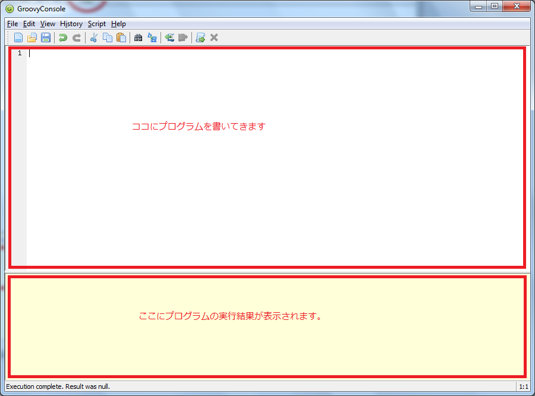

# Apache Groovyとは

[Apache Groovy](http://www.groovy-lang.org/)（以下Groovy）とは、現在 Apacheソフトウェアファウンデーション配下で開発が進められている **動的型付け言語** です。  
厳密な定義すると色々語弊があるかもしれませんが、 **Groovyはいわゆるスクリプト言語です。**

GroovyはJava Virtual Machine(以下JVM)上で動作します。  
なお、JVM上で動くJava以外のプログラミング言語には他にも色々なものが有ります。  
代表的なものとしては[Scala](http://www.scala-lang.org/)や[Kotlin](https://kotlinlang.org/)があります。  
この2つのプログラミング言語は、いわゆる **静的型付け言語** に属し、Groovyとは少し毛色が違います。  
そういう意味では、Groovyは同じJVM上で動くLISP方言の[Clojure](https://clojure.org/)の方に近いかもしれません。  

なお、Groovyの立ち位置としては、 **Javaを置き換えるものではなく、Javaに寄り添うもの** とよく表現されます。  
基本的にGroovyはJavaのコードをコピペすればそのままGroovyとして動作します。  
`HelloWorld.java`をの拡張子を.groovyに変えて`HelloWorld.groovy`とするだけでOKなのです。  
このことから以下にGroovyがJavaとの親和性を大切にしているかが伺えます。  

## シンプル&パワフル
GroovyはJavaの良い点を踏襲しつつ、スクリプト言語らしく非常にシンプルにコーディングできるようになっています。  
さらに、関数型プログラミングのエッセンスも取り入れてコードをより簡潔に表現することも出来ます。  

例えば、1から10の整数の入ったリストから偶数のみ抜き出して、それぞれを2倍して、全ての数をかけあわせる、という処理を実装してみます。

```groovy
(1..10).findAll {
    it % 2 == 0
}.collect {
    it * 2
}.inject {l, r ->
    l * r
}
```

非常に簡潔ですね！  
forの様なループやifによる条件分岐、さらに途中の計算結果を代入する一時変数すら登場しません。  
そしてGroovyはセミコロンと、明示的なreturnは不要です。  
また、型の指定も省略することが可能です。  

Groovyではクロージャー（Closure）が簡単に利用できます。  
クロージャーを利用することで、Java8から導入されたStreamやLambdaと同じような事を、より簡潔に表現することが出来ます。  
例えば、クロージャーを利用して数学のシグマ（Σ）を実装してみます。

```groovy
def sigma = {Integer k, Integer to, Closure exp ->
    (k..to).collect {
        exp(it)
    }.sum()
}
assert 25 == sigma(1, 5) {it + 2}
```

これまた簡潔ですね。  
すでにGroovyでは型を省略できると書きましたが、逆に型を明示することも当然可能です。

## 巨大なエコシステム
Groovyにはすでに10年以上の歴史が有り、Groovyの為の様々なツールが有ります。  
そして、JVMの上で動く様々なJava用ライブラリを利用することも可能です。  
あなたがJava用ライブラリを使ったことがあるのであれば、そのライブラリはGroovyからも利用できる上に、Groovyのシンプル＆パワフルなシンタックスを利用することでよりお洒落に記述することができます。


また、Groovyでよく利用されるある程度規模の大きなフレームワークなどには以下のようなものが有ります。

- フルスタックなWEBフレームワーク「[Grails](https://grails.org/)」
- ノンブロッキングでシンプルなマイクロフレームワーク「[Ratpack](https://ratpack.io/)」
- 平行/並列処理を簡単に実現できる「[GPars](http://www.gpars.org/)」
- BDDなユニットテストフレームワーク「[Spock](https://github.com/spockframework/spock)」
- ブラウザからの機能テストをシンプルに実装できる「[Geb](http://www.gebish.org/)」
- ビルドツール「[Gradle](http://gradle.org/)」

**GroovyはJavaのエコシステムに直接リーチするだけでなく、そのエコシステム自体の一員となり、さらにそのエコシステムを押し広げるものです。**  
[Ratpackの入門、チュトーリアルも公開しています！](http://koji-k.github.io/ratpack-tutorial/)コチラも順次内容を補填していきます。


## 気軽に実行
さて、巨大なエコシステムとかライブラリとかっていう話を聞くと「何か難しそう。実行するの面倒くさそう」と思っちゃいますね。  
いえいえ。Groovyはそんなことありません！
Groovyには、最近のモダンな言語にはよくある **REPL** も付属しています。  
Groovyをインストールしたらコンソールで`groovysh`と入力するだけでREPLが起動します。  
REPLを利用することで手軽に、即座にコードを確認することが出来ます。  

```terminal
[saba:~]$ groovysh
Groovy Shell (2.3.11, JVM: 1.8.0_60)
Type ':help' or ':h' for help.
------------------------------
groovy:000> a = "Hallo"
===> Hallo
groovy:000> println a
Hallo
===> null
groovy:000> 2 * 4
===> 8
groovy:000> (1..5).inject {a,b -> a * b}
===> 120
groovy:000> 
```

さて、この諸々のモダンな言語にも備わっている便利なREPLですが、Groovyに限らずScalaやClojureでも、REPLでちょっと長い関数などを書いて実行するとシンタックスエラーと言われてもう一回書く羽目になってイライラ。。。という経験は誰にだって有ります（よね？）  
そこでGroovyには **GroovyConsole** という、簡易的な統合開発環境まで備わっています。  
WindowsならGroovyのインストールディレクトリに、LinuxやMacはコンソールから `groovyConsole &`と入力することで利用することが出来ます。  
あくまで簡易的な統合開発環境なので、コードの補完やデバッガなどは付属していません（が、クラスパスを追加したりなどの痒いところに手が届く機能搭載！）  
  
しかし、この`GroovyConsole`の最大の特徴は、すでに起動したJVM上でコードが走るので、 **プログラムの実行がJVM系言語とは思えないほど高速だということです。**  
さらに、同じ画面上にコードの実行結果が表示されるので、結果を確認しつつコードを修正して、即座に再実行することが出来るため、非常に効率よくコーディングできます。  

このように、GroovyにはREPL（groovysh）とGroovyConsoleという強力な開発サポートツールが付属しています。  
この2つを利用することで、Groovy自体の勉強はもちろん、ロジックの確認、検証コードの作成、さらには業務をサポートするためのツールとしても利用することが出来ます。  
**なによりサクサクコーディグ＆実行が出来るので、プログラミング自体がとても楽しくなります！**

## 実験コードのお供に
開発をしていて、ある機能が必要になり、あるアルゴリズム/ロジックをコードを書きながら試行錯誤したい、ということはよく有りますよね？   
Groovyは標準で様々な便利機能が用意されています。  
例えば、言語機能として`assert`（パワーアサート）が有ります。  
コレは、そのような実験コード（例えばどんなアルゴリズムにしようかを決める際に色々書くコード）に非常に便利です。  

実際にサンプルを見てみましょう。

```groovy
class SomeClass {
    def someMethod() {
        "Groovy"
    }
}

def someClass = new SomeClass()
assert "groovy" == someClass.someMethod()
```

最後の行がパワーアサートの部分です。  
この例だとsomeMethodの戻り値は先頭が大文字なのに、意図した結果は先頭小文字なので、当然エラーがになります。  
エラーなお内容は非常に分かりやすく表示されます。  

```terminal
Assertion failed: 

assert "groovy" == someClass.someMethod()
                |  |         |
                |  |         Groovy
                |  SomeClass@3e633f10
                false

	at ConsoleScript6.run(ConsoleScript6:8)
```

こうすることで、メソッドの中身の実装を変えた際に、毎回目で実行結果に誤りが無いか、挙動が変わっていないかの確認が必要が無くなります。  
さらに、GroovyConsoleやGroovyshと言ったGroovyに備わっているツールを使えば、態々IDEやテキストエディタを開く事無くコードを試すことが出来ます。  
（GroovyConsoleはGUIツール、groovyshはCUIツール。いわゆるREPL）

## ビルドツール要らず
さて、では少し「実験コード」の範囲を広げましょう。  
例えばあなたが参加しているJavaプロジェクトであるJavaライブラリを導入することになったとします。  
そのライブラリの使い方をチェックするために態々山のようなクラスファイルを作る必要も、その外部ライブラリをクラスパスにと通す必要も、既存のプロジェクトコードを汚す必要もありません。  
さらにGradleやMavenといったビルドツールを導入したり、そもそもその対象ライブラリをダウンロードしてくる必要さえ無いのです。  
Groovyは言語機能として、 **Grab** という機能が有ります。このGrabに必要なライブラリの情報（Mavenに記述する様な情報）を渡してあげるだけで、ダウンロードからクラスパスの設定まで全てGroovyが自動で行ってくれます。  
例えば、ココではJsoupというJavaのWEBスクレイピングによく利用されるライブラリを導入してみましょう。

```groovy
@Grab(group='org.jsoup', module='jsoup', version='1.8.3')

import org.jsoup.Jsoup
import org.jsoup.nodes.Document
import org.jsoup.nodes.Element
import org.jsoup.select.Elements

Document document = Jsoup.connect("http://koji-k.github.io/groovy-tutorial/index.html").get()
document.select("a").collect {Element element ->
    "[${element.text()}](${element.attr("href")})"
}.each {
    println it
}
```

これだけです。必要なのは上記のGroovyコードだけです。後は全てGroovyが面倒を見てくれます。  
当然ある程度規模の大きなアプリケーションになってくるとGradleやMavenを利用したほうが良いですが、Groovyではこのように日々のちょっとした業務をサポートしてくれる強力な機能が非常に多く備わっています。  

（Grabの詳細は本チュートリアルの [Groovyで外部ライブラリを利用する](external-library/index.html) を参照してください。）

## Javaの友達
すでに述べたとおり、Javaコードは基本的にそのままGroovyとして動作します。  
さらにGroovyの場合は1ファイルに1クラス、というルールがありません。つまり1ファイルにいくつもクラスを宣言することが出来ます。  
そしてクラスの宣言自体必要ありません。

```groovy
class A {
    def hoge() {
        println "A"
    }
}

class B {
    def hoge() {
        println "B"
    }
}

def a = new A()
def b = new B()
a.hoge()
b.hoge()
```

このコードは1ファイルに詰め込んでもちゃんと動作します。  
このように、余計な事を考えずに必要なことに集中することができるのでこれからJavaを学習したい、というひともGroovyからJavaを効率よく勉強することが出来ます。  
そしてとても重要なことですが、JavaのAPIが利用できる知識があるのであれば、 **あなたはすでにGroovyエンジニアです！**  
そこに少しだけ本チュートリアルの知識をプラスαするだけで、 **最小の苦労で非常に多くのモダンな機能、そして知識を得ることが出来ます。**  
**Groovyはいつだって、あなたとJavaに寄り添う友達です。**


## もちろんプロダクトとしても
Groovyは、2016年の時点で登場からすでに13年が経っています。  
Javaの知識をそのままGroovyで利用できるので、学習コストはほぼゼロです。  
スクリプト言語とは言え、実行時にはすでにclassファイルにコンパイルされているので、開発、デプロイ、運用というイテレーションもJavaの知識をそのまま流用できます。  
つまり、Groovyにはすでに実戦で利用できる十分な実績、ライブラリが備わっているということです！

## どこからでもOK
JVMという実績のある環境の上で動作し、膨大なJavaのエコシステムを利用でき、シンプルで実用的な機能を抱負に揃えたGroovy。  
さらにコレクションを変換して、集約していき、可能な限り副作用を減らすという関数型プログラミングのエッセンスも含まれています。  
また、直ぐにプロダクトとして導入しなくても、ちょっとしたデータの作成用や、簡単なバッチファイルとしての利用などにも利用できます。  
JavaのコードがそのままGroovyとして動作するので、まずはJavaシンタックスで書いておいて、あとからGroovyのシンタックスに少しずつ変えていくということも可能です。  
Groovyは常に現実的な業務に寄り添ってくれます。あなたの必要だと思える場所、タイミングで、いつでも使いはじめることが出来る相棒です。  

**さぁ、Groovyを初めましょう！**